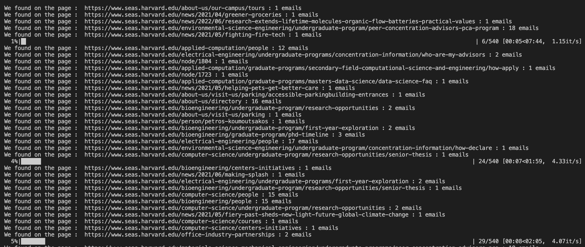
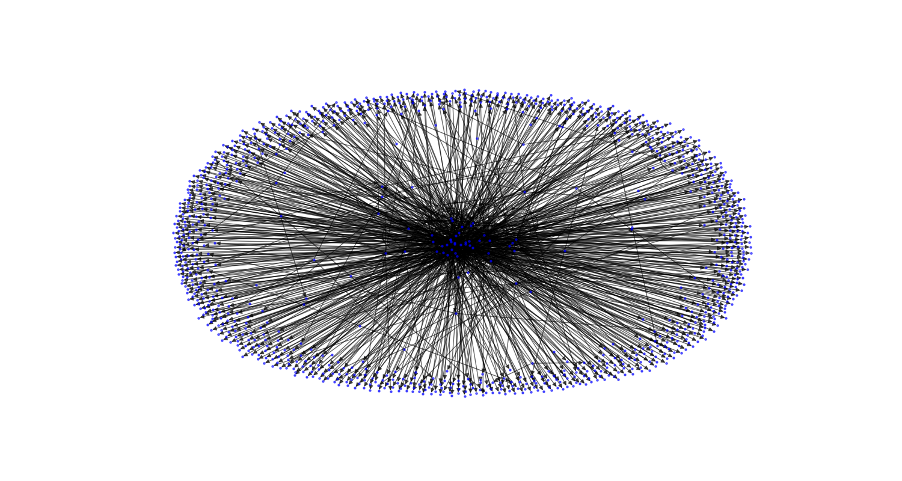
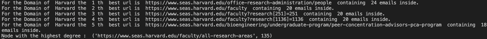
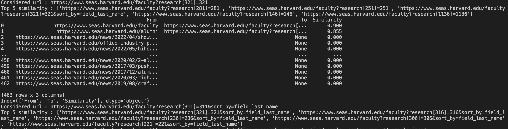

# WebCrawly

## Introduction

This repository contains a webcrawler used to search the web for valid e-mail addresses that can later be used for various purposes (i.e. sending marketing material, etc.). In my case, I tried it on various US Universities website. 
### Input 

The "Seed" (_input_) is a list of URLs that we start crawling, and the crawler will collect all emails adresses it contains on the pages pointed by these URLs. Then, it continues to all hyperlinks pointing to other urls and so on.

### Output

The output is a knowledge directed graph holding the crawled objects. Each nodes represent a url (a page), an edge represents it oriented link from one page to another. Each nodes contain the list of email its html contains.

# Scripts
## Webcrawler 🌏 
### Environment 
To run the Webcrawler you need to check that your environement will run properly. In order to do so you have the requirements.txt file at your disposal.
I suggest you to create a conda environment dedicated for the webcraler. 

The script is running locally on my computer with a Python 3.10.4 version. 

### 1. webcrawler.py : Construction of the KG 🏗️
This is the main script that build the the output knowledge graph. 
You need to specify the input and output name arguments when you launch it, such that : 

`python3 webcrawler.py -seed_URL url1 url2 -output_name_graphs name1 name2 -max_urls_visited the_number_you_want -nb_thread the_number_you_want`

The parameters: 

- `-seed_URL` contains the seed list of URLs (domain that needs to be visited),

- `-output_name_graphs`contains its respected output names,

- `-max_urls_visited` is the maximum number of scraped nodes,

- `-nb_thread ` is the number of thread lauched during the scrapping.

In case you need help, you can access to the help by running :
`python3 webcrawler.py -h`.

### Crawling strategy ⚡

The first loop will loop over each seed urls (to Pooling) and then for each seed launch the webcrawler. 
The webcraler is implemented as a class and each webcrawler object contains a list of already visited urls and urls to be visited. Every time a node is visited, it is added to to the first list, removed from the second list, and for each new visited nodes we add the found scrapped urls on the html pages to the list of urls to be visited. In the case a url page contains an already visited nodes we will simply not add it to the "to be visited" urls list. This is almost everytime the case as we usually have the "logo" on the top of a page which redirects to the home page domain. 

In order to maximise the bandwidith, I use two ThreadPoolExecutor (see `-nb_thread` parameter above). 
The first one for scrapping the URLS of each visited new nodes, the second scrapped in a multithreading way all emails contains in the final graphs. 

A progress bar (tqdm) is implemented, which follows the progress of emails scrapping for each node of the final graph, as follow : 

### Graph analysis : most_relevant.py 🔍

To launch the analysis of the graph called "NAME" and search for the top K-th relevant you need to run the following command : 

`python3 most_relevant.py -top_K K -graph_name NAME`

The most_relevant.py script will analyse the full G graph given and will find the top K most relevant urls in the graph - for a given domain - by doing the following analysis : 
- Output the list of the nodes with the highest numbers of emails scrapped, as well as the name of this url / node for the given domaine of G
- Within the top 30 best url (highest number of emails contained), we compute the levenstein measure between them to see if there is more frequent pattern of finding a nice url. Usually serial url can be found as the best like http://website.come/contacts[1] where 1 is a serial id. 
- Output the url with the highest degree, meaning the url which contains the highest number of hyperlink within its html. 

# Use case : US 🇺🇸 Universities Mailing marketing campaing example

## Run an example on Princeton and Harvard
We construct the 2 knowledge graphs for Princeton and Harvard (with a maximum of 1000 urls visited and a max number of theards equal to  128):
`python3 webcrawler.py -seed_URL https://fas.yale.edu/division-science https://www.seas.harvard.edu/
 -output_name_graphs Yale_test Harvard_test -max_urls_visited 1000 -nb_thread 128`
 We analyse those graphs : 
 `python3 most_relevant.py -top_K 5 -graph_name Yale_test Harvard_test`

## Results found for Harvard: 

### Harvard
Domain KG representation 

Concerning similarities for the top 30 URLS, we give an example : 
For the following url : https://www.seas.harvard.edu/faculty?research[321]=321
We compute the similarities regarding the remaining 29 top URLS and we find that there is a relevant patter recognized !

We know now that we can target the url with the following form: 
https://www.seas.harvard.edu/faculty?research[id]=id&sort_by=field_last_name
where id is clearly a serial number. 

# Further improvements
## Ontologies
Ontologies can be added to the knowledge graph such that we can link domains between them and leverage our different source of knowledge. 
## To go further ...
We could also apply more advance ideads to detect cluster of urls that contains a lot of emails, such as adding weights to each url/nodes. 
